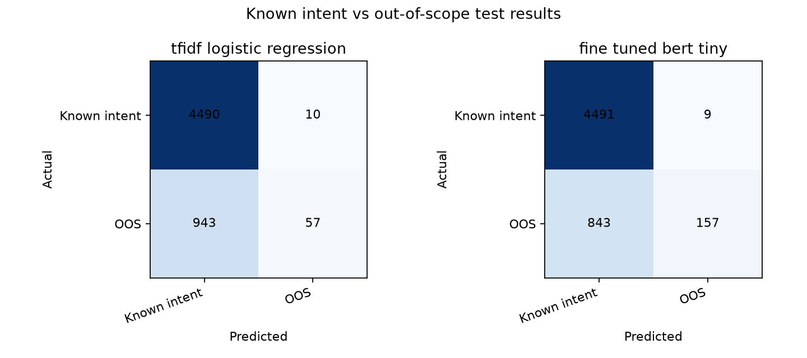

# Intent Classifier Fine-Tuning

Fine-tune a small pretrained BERT model to classify short requests by intent, then compare it with a TF-IDF plus logistic-regression baseline. This project demonstrates transfer learning, text classification, validation-based checkpoint selection, multi-class evaluation, and an `out-of-scope` class.

## Run it

Requires Python 3.12 and internet access for the first pretrained-model download. The model is small (4.43 million parameters); the code trains on CPU and does not require a GPU or API key.

```powershell
git clone https://github.com/tristan-hooper/intent-classifier-finetuning.git
cd intent-classifier-finetuning
py -3.12 -m venv .venv
.\.venv\Scripts\python.exe -m pip install -r requirements.txt
.\.venv\Scripts\python.exe intent_classifier.py train
.\.venv\Scripts\python.exe intent_classifier.py predict "I need to check the current balance on my account"
.\.venv\Scripts\python.exe -m pytest -q
```

The training command fits both methods on the same training rows, evaluates each epoch on validation data, saves the BERT checkpoint with the best validation macro F1, and evaluates the saved checkpoint on test data once. Reports are written to `reports/`. The trained model is saved in ignored `models/`; rerun `train` before using `predict` after a fresh clone.

## What it does

CLINC150 contains 150 intent categories across everyday task-oriented requests and a separate `oos` category for queries outside those intents. The full benchmark is included in `data/clinc_oos_full.json` under its published CC BY 3.0 license and is attributed in `data/DATASET_NOTICE.md`.

The classifier predicts exactly one of 151 labels. `oos` is a learned class; this project does not set a confidence threshold or implement a refusal or escalation policy. It demonstrates request classification mechanics, not a deployable assistant.

The pretrained model is Google's two-layer, 128-hidden-size BERT-Tiny. Its revision is pinned in `project_config.json`. The 151-label mapping is derived only from training labels; held-out labels are checked against it. Inputs are checked against the configured 64 WordPiece limit before padding, with no silent truncation. The dataset's longest observed input is 33 WordPieces. The optimizer is AdamW. Training runs for up to three epochs and chooses the checkpoint by validation macro F1. The test set does not guide training, epoch choice, or threshold tuning.

## Evaluation

On the fixed 5,500-example test split, TF-IDF plus logistic regression scored **73.49% accuracy and 0.8083 macro F1**. Fine-tuned BERT-Tiny scored **71.45% accuracy and 0.7632 macro F1**. BERT-Tiny had higher `oos` F1 (0.2693 vs. 0.1068), though its `oos` recall was 15.70%. Fine-tuning did not beat the baseline overall on this benchmark; that comparison is a useful result, not a failed project.



`reports/summary.md` contains measured results from this code and fixed dataset. `reports/metrics.json` records the input hash, model and data revisions, dependency versions, training settings, epoch history, split-overlap counts, and test metrics. `reports/test_predictions.jsonl` provides each test example's label and both predictions, and `reports/oos_confusion.png` compares in-scope and `oos` outcomes.

The report includes accuracy and macro F1 across all 151 classes, known-intent accuracy, and `oos` precision, recall, and F1. Macro F1 gives rare classes equal weight. The test set has a higher `oos` share than train and validation, so report the benchmark composition alongside OOS metrics. The model's maximum softmax output is not a calibrated confidence probability. Results are specific to this dataset; they do not establish hospital-message performance, safety, or readiness for real requests.

The original data also has a small number of repeated utterances across splits. Two exact train/test utterances have conflicting labels, and three exact train/validation utterances include two label disagreements. The benchmark is preserved as published; these overlaps are counted in `metrics.json` and limit how independently the test score should be interpreted. Results are from one fixed-seed run without confidence intervals or repeated-seed analysis.

## Skills shown

- Prepare fixed training, validation, and test splits without test-set tuning.
- Tokenize text and fine-tune a pretrained transformer with labels.
- Compare the neural model with a simpler supervised baseline.
- Report multiple-class and out-of-scope errors instead of accuracy alone.
- Save a model for inference and preserve reproducible inputs and settings.

See [DATA_CARD.md](DATA_CARD.md) for source, splits, attribution, and limits. The project code is licensed under [MIT](LICENSE). BERT-Tiny's model card lists [Apache 2.0](https://huggingface.co/google/bert_uncased_L-2_H-128_A-2). The dataset's terms are documented separately because they differ from the code license.
